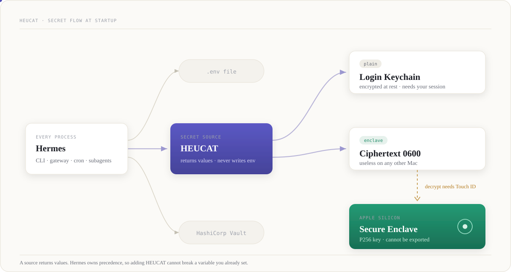
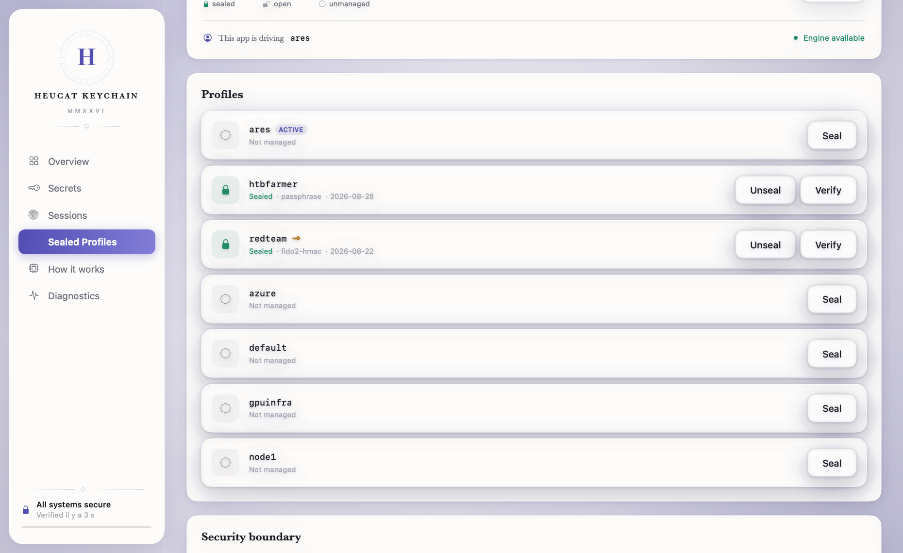

<div align="center">

# HEUCAT

**H**ardware **E**nclave **C**redential **A**uthentication **T**ool

Serve [Hermes Agent](https://github.com/NousResearch/hermes-agent) API keys from the macOS Keychain
instead of a plaintext `.env` file.<br/>
The ones that matter sit behind Touch ID, encrypted with a key that never leaves the Secure Enclave.

[](https://www.apple.com/macos/)
[](https://support.apple.com/guide/security/secure-enclave-sec59b0b31ff/web)
[](#tests)
[](#desktop-app)
[](#license)

[Documentation site](https://iacker.github.io/heucat/) · [Install](#install-in-three-commands) · [First run](#first-run-step-by-step) · [Threat model](#security-model) · [Desktop app](#desktop-app)

</div>

---

## Install in three commands

Needs a Mac with Apple silicon, [Hermes Agent](https://github.com/NousResearch/hermes-agent)
already installed, and Xcode Command Line Tools (`xcode-select --install`).

```bash
git clone https://github.com/iacker/heucat && cd heucat
./install.sh            # links the plugin, builds the Secure Enclave helper, prints the config stanza
hermes keychain store OPENROUTER_API_KEY
```

Add `--app` to `install.sh` for the menu-bar app (about two minutes of Swift
compile), or grab the prebuilt one from the
[latest release](https://github.com/iacker/heucat/releases/latest). It is ad-hoc
signed, not notarized, so macOS quarantines it once:

```bash
unzip HEUCAT-Keychain.zip -d /Applications
xattr -dr com.apple.quarantine "/Applications/HEUCAT Keychain.app"
open "/Applications/HEUCAT Keychain.app"
```

Then `hermes keychain status` shows what is stored. Everything below
explains why it is built this way; you do not need it to use it.

## First run, step by step

The desktop app has a **Tutorial** page that checks each step from live state.
It does not store a separate checklist, so a green check means the CLI can see
the result now.

1. **Check the Hermes connection.** Open **Tutorial** and click **Check now**.
   The first check turns green when the `keychain` secret source is enabled for
   the selected Hermes profile. If it stays empty, open **Settings** and verify
   the Hermes home, executable, plugin, and helper paths.
2. **Build the Secure Enclave helper.** `install.sh` builds it during setup. The
   app can also build it on the first enclave secret. Open **Diagnostics** if
   the helper check stays empty. This build does not create or read a secret.
3. **Store a plain secret.** Use **Add a secret**, choose **Apple Keychain**, and
   enter an environment variable name such as `OPENROUTER_API_KEY`. Plain mode
   is for gateway or cron credentials that must be available without Touch ID.
   The value is sent to the local CLI over stdin and is never shown again.
4. **Store an enclave secret.** Use **Add an enclave secret** and keep **Secure
   Enclave** selected. The value is encrypted before it is written. Only the
   public half of the hardware key is needed, so storing does not ask for Touch
   ID.
5. **Unlock enclave secrets.** Click **Unlock** once. macOS asks for Touch ID or
   user authentication. A successful touch opens all enclave secrets for the
   configured session TTL. Hermes startup stays silent and non-interactive.
6. **Close the session when the screen locks.** Turn on **Lock when the screen
   locks**. The app clears enclave sessions when macOS locks the display. You
   authenticate again after returning.

The same flow is available without the app:

```bash
hermes keychain status
hermes keychain store OPENROUTER_API_KEY
hermes keychain store GITHUB_TOKEN --enclave
hermes keychain unlock
hermes keychain lock
```

Do not put the real value on the command line. Each `store` command prompts in
protected input, and the app uses stdin. If a step fails, **Diagnostics** shows
paths, source state, helper state, and the last command result without printing
secret values.

## Where it sits

Hermes asks a chain of secret sources for its environment variables at startup.
HEUCAT is one of them. Nothing else in Hermes changes.

<div align="center">
  
</div>

A source never writes to the environment itself. It returns values and Hermes
decides precedence, so adding this plugin cannot break a variable you already
set another way.

The repo and the plugin still answer to the name `keychain` internally, so
nothing in your config changes. HEUCAT is the product name the app and these
docs use.

This is the runtime half of a pair. [hermes-chthonios](https://github.com/iacker/hermes-chthonios)
seals a whole profile at rest. This plugin hands individual secrets to a running
process.

## Contents

| | |
|---|---|
| [What it actually does](#what-it-actually-does) | the four moving parts |
| [Two modes](#two-modes) | plain for daemons, enclave for the rest |
| [Install](#install-in-three-commands) | clone, enable, store |
| [First run](#first-run-step-by-step) | six checked steps in the app or CLI |
| [How enclave mode works](#how-enclave-mode-works) | the three moments, one prompt |
| [Headless and daemon setups](#headless-and-daemon-setups) | launchd at boot |
| [Config reference](#config-reference) | every key under `secrets.keychain` |
| [CLI](#cli) | the six commands |
| [Desktop app](#desktop-app) | optional SwiftUI front end, FR and EN |
| [Security model](#security-model) | what each mode stops, and what it does not |
| [Tests](#tests) | 41, and how to run them |

## What it actually does

Hermes reads its API keys from environment variables at startup. Normally those
come from a `.env` file sitting in your profile directory. This plugin registers
itself as a secret source, so Hermes asks the Keychain instead and the `.env`
file no longer has to hold anything sensitive.

Concretely, four things:

`hermes keychain store NAME` writes a value into the macOS Keychain and records
the binding, so you never edit `config.yaml` by hand. Pass `--enclave` and the
value is encrypted against a Secure Enclave key instead.

At every Hermes startup, the plugin's `fetch()` reads those values and hands them
back. This runs for the CLI, the gateway, cron jobs and subagents. It never
prompts, so nothing can hang waiting for input that no one is there to give.

`hermes keychain unlock` is the interactive half, and only enclave secrets need
it. One Touch ID prompt opens a time-limited session covering all of them at
once. `lock` closes it early.

`hermes keychain status` reports what is stored and whether it is currently
readable. The bundled Mac app is a window onto that same command: it adds,
deletes, unlocks and locks, and it shows Chthonios state alongside. It never
displays a secret value, and values reach the CLI over stdin so they never appear
in `ps` or shell history.

What it does not do: it is not a password manager, it does not sync anywhere, and
it does not hold website logins. It moves machine credentials off the flat file
for one Mac.

## The problem

A Hermes `.env` file is a list of API keys in plaintext, mode 0600. That is fine
against another user account on the same Mac. It does nothing against anything
running as you: a curious npm postinstall script, a browser extension with file
access, a backup that syncs somewhere you forgot about.

Moving those keys into the Keychain does not magically fix that. A plain Keychain
item is readable by any process running as you once the login keychain is
unlocked, which is all day. What it does fix is the flat file: `cat .env` stops
being a credential dump, and backups stop carrying keys.

Enclave mode is the part that actually raises the bar. The value is encrypted
with a P256 key generated inside the Secure Enclave, and decryption requires a
live human authentication. Until someone touches the sensor, an attacker with
full read access to your disk gets ciphertext.

## Two modes

| | `plain` | `enclave` |
|---|---|---|
| Storage | Keychain generic password | Ciphertext file, key inside the Secure Enclave |
| Read requires | an unlocked login session | live user authentication |
| Works headless | yes, via the System keychain | no, by design |
| Prompt at Hermes startup | never | never, you unlock out of band |
| Value at rest | encrypted by the Keychain | ChaChaPoly, key that cannot be exported |

Pick plain for anything a daemon or cron job needs at boot. Pick enclave for keys
where you would rather the process fail than have them read silently.

## Install by hand

If you would rather not run a script:

```bash
git clone https://github.com/iacker/heucat \
    ~/.hermes/plugins/keychain-secretsource
```

Enable it in `~/.hermes/config.yaml`. The key is `keychain`, which is the plugin
name from the manifest, not the directory name:

```yaml
plugins:
  enabled:
    - keychain

secrets:
  sources: [keychain]
  keychain:
    enabled: true
```

If you run profiles, the plugin goes in that profile's directory instead, for
example `~/.hermes/profiles/<name>/plugins/`.

The Secure Enclave helper compiles itself the first time you store an enclave
secret. You need Xcode Command Line Tools for that (`xcode-select --install`).

## Storing secrets

```bash
hermes keychain store OPENROUTER_API_KEY            # plain
hermes keychain store GITHUB_TOKEN --enclave        # Secure Enclave
```

Storing registers the secret automatically, so you do not have to hand-edit
`config.yaml` to declare it. The registration lives in a 0600 JSON file under
your profile and is written atomically. Explicit `accounts` and `items` entries
in `config.yaml` still work and still take precedence, so an existing setup keeps
behaving the way it did.

For enclave secrets, authenticate once per session:

```bash
hermes keychain unlock
```

Then check where things stand:

```bash
hermes keychain status
```

## How enclave mode works

Three moments matter, and only one of them ever asks you for anything.

| Moment | What runs | Does it prompt? |
|---|---|---|
| **Storing** `store NAME --enclave` | the Enclave generates a P256 key once and hands back only its public half; the value is written as ChaChaPoly ciphertext, mode 0600 | **No.** Encryption only needs the public half |
| **Unlocking** `unlock` | the Enclave decrypts every secret at once; plaintexts are cached as TTL-bounded session records | **Once**, one Touch ID for the whole batch |
| **Every Hermes startup** | `fetch()` reads session records and returns values, or fails fast | **No**, ever: startup must stay non-interactive |

Encryption only needs the public half, so adding a secret never prompts.
Decryption is the only step that needs the private key, and the Enclave releases
it only after a live human authentication.

`keygen` creates the P256 key inside the Secure Enclave, gated on user presence.
Add `--strict-biometry` to bind it to the fingerprints enrolled right now, so
enrolling a new finger invalidates it. The exported key blob is useless on any
other machine.

`unlock` authenticates once for the whole batch, then caches the plaintexts as
TTL-bounded session records in the login keychain. They are encrypted at rest by
macOS, namespaced per Hermes profile, and expired records delete themselves.

Be honest about what that last step costs you. During the TTL window, those
values are readable by a process running as your unlocked user, which is the same
exposure as plain mode. That is the tradeoff for letting cron jobs and gateway
children start without a prompt. `hermes keychain lock` closes the window early,
and a short `session_ttl_seconds` narrows it.

`fetch()` only ever reads session records. A locked secret produces a warning, or
`AUTH_EXPIRED` with a hint when nothing is readable. It never blocks startup,
because gateway, cron, and subagent processes have to stay non-interactive.

## Headless and daemon setups

launchd jobs at boot have no login session, so use plain mode against the System
keychain:

```yaml
secrets:
  keychain:
    enabled: true
    default_keychain: /Library/Keychains/System.keychain
    accounts: [OPENROUTER_API_KEY]
```

```bash
sudo security add-generic-password -U -s hermes \
    -a OPENROUTER_API_KEY -w "$VALUE" /Library/Keychains/System.keychain
```

## Config reference

Everything lives under `secrets.keychain`.

| Key | Default | Meaning |
|---|---|---|
| `enabled` | `false` | Master switch |
| `service` | `hermes` | Keychain service name for plain items |
| `accounts` | `[]` | Env var names in plain mode, account name equals the variable |
| `items` | `[]` | Per secret: `{env, mode: plain\|enclave, service?, account?, keychain?}` |
| `default_keychain` | `""` | Keychain file for plain reads, empty means the search list |
| `session_ttl_seconds` | `28800` | How long an unlock stays valid, 8 hours |
| `timeout_seconds` | `30` | Wall clock budget for a fetch |

## CLI

```
hermes keychain setup                 walk through first-time setup
hermes keychain store <ENV> [--enclave] [--service S] [--account A]
hermes keychain unlock                one auth, opens every enclave session
hermes keychain lock                  clear sessions now
hermes keychain status                per secret state
hermes keychain delete <ENV>          remove item, ciphertext, session, registration
```

`store` also accepts `--stdin` so a GUI or a script can pipe a value in without
it ever appearing in `ps` output or shell history.

## Desktop app

There is an optional SwiftUI app in [`ui/`](ui/). It shows source and per secret
state, adds and deletes secrets, tests whether a key still answers, and runs
unlock or lock without a terminal. It shells out to the same plugin CLI and pipes
secret values over stdin, so nothing sensitive lands in process arguments.

The interface ships in French and English, switchable live from the title bar or
Settings without restarting. A How it works page explains the Enclave chain in
plain language, for the times you have to justify this to someone who does not
read Swift.

It also has a Sealed Profiles section that drives [hermes-chthonios](https://github.com/iacker/hermes-chthonios)
end to end: seal a profile behind a passphrase or a YubiKey, unseal it, lock it,
verify the ciphertext. The page opens on the numbers (how many profiles are
sealed, open or unmanaged, and which one this app is driving) rather than on a
description of the engine behind it.

The two crypto engines stay separate on purpose. Only the dashboard is shared,
so you can see runtime secrets and sealed profiles in one window without one
system pretending to be the other.

**One YubiKey covers as many profiles as you like.** The FIDO2 credential lives
on the token; a profile's recipient and identity files only address it. So once
any profile is enrolled, the seal sheet offers to bind the next one to the same
key in a click, with no touch and no ceremony. Enrolling the *first* key is
still a terminal step (`chthonios enroll-key <profile>`), because it is an
interactive ceremony and a failed attempt costs you one of the token's limited
PIN retries.

Failures are read from the CLI's exit codes, never from its message text, so a
wrong passphrase stays distinguishable from a missing profile even in the
French build. `ui/scripts/check-exit-codes.py` fails the build if the Swift
enum and `chthonios/cli.py` ever disagree.

<div align="center">
  
</div>

```bash
cd ui
./scripts/test.sh
./scripts/build-app.sh
cp -R "dist/HEUCAT Keychain.app" /Applications/
open -a "HEUCAT Keychain"
```

The build script generates the icon from `ui/assets/icon-source.png` when Pillow
is installed, and falls back to the committed `AppIcon.icns` when it is not, so
the bundle always ships with an icon. Once it sits in `/Applications` it shows up
in Finder, Launchpad and Spotlight like any other app.

If you are packaging this yourself, note that the bundle deliberately does not
set `LSUIElement`. That flag turns the app into a menu bar agent with no Dock
icon, which is a reasonable choice for a background utility and a bad one for
something you want to find and open.

The build is ad-hoc signed, which is fine locally. Handing the binary to someone
else means a Developer ID signature and notarization.

## Security model

What each mode actually stops, and what it does not. Read the last column before
you decide a key is safe.

| Threat | `.env` file | `plain` mode | `enclave` mode |
|---|---|---|---|
| Someone reads your disk (backup, cloud sync, stolen Mac) | **Plaintext. Game over.** | Encrypted at rest, needs your login session | **Ciphertext only, useless off this Mac** |
| A process running as you (npm postinstall, browser extension), *before* any unlock | Readable | Readable | **Unreadable** |
| The same process, *after* `unlock`, within the TTL | Readable | Readable | **Readable. This is the tradeoff** |

The last row is the honest part. Once you unlock, a process running as you can
read those values for the length of the TTL. That is the price of never
prompting a cron job. `hermes keychain lock` closes it early, and a short
`session_ttl_seconds` narrows it.

`fetch()` never raises, never prompts, and never writes to `os.environ`. Hermes
owns precedence and application. This plugin only returns a result.

Subprocess calls pass an argv list with a minimal allowlisted environment and
stdin closed. `/usr/bin/security` therefore cannot prompt, and a locked keychain
fails fast instead of hanging. Secret values go over stdin, never in `argv`,
because anything in `argv` is readable by `ps`.

The Swift helper is about 200 lines in `helper/main.swift`. You can read the
whole thing in one sitting, which was the point.

Enclave ciphertexts and the key blob live under `$HERMES_HOME/keychain/` at mode
0600. Copying them to another Mac gets you nothing, because the private key
cannot leave this machine's Secure Enclave.

### Two findings worth recording

**Biometric Keychain ACLs do not work for an open source CLI.**
`SecAccessControl` biometric flags require the Data Protection keychain, which
requires a paid Apple Developer application-identifier entitlement. An ad-hoc
signed binary cannot get one, and the attempt fails with
`errSecMissingEntitlement`. Encrypting against an enclave key, the same approach
age-plugin-se takes, gets the same guarantee without the entitlement.

**`/usr/bin/security` truncates a prompted password at 128 characters and still
exits 0.** A long OAuth token was stored cut in half and surfaced later as a
corrupt session record. Passing the value as an argument instead would put the
secret in `argv` where `ps` reads it, which is worse. So writes now verify
themselves by reading back, and a short write is reported instead of stored.
Session payloads above the ceiling spill to a 0600 file. Pinned by
`tests/test_long_values.py`.

## Tests

```bash
HERMES_AGENT_SRC=~/.hermes/hermes-agent \
  PYTHONPATH=~/.hermes/hermes-agent \
  uv run --with pytest --with pyyaml --with rich python -m pytest tests/ -v
```

41 tests. Most are hermetic, so no real keychain or enclave is touched, and they
include the upstream `SecretSourceConformance` kit. The long-value regression
tests in `tests/test_long_values.py` do touch a scratch Keychain item, because
the bug they pin only reproduces against the real `security` binary.

The Swift side has its own check, plus two guards that fail on drift: one for
the FR/EN string tables, one for the exit codes the UI reads from Chthonios:

```bash
cd ui && ./scripts/test.sh
```

That script runs the StatusParser self-test, `check-exit-codes.py` and
`check-strings.py` in one go.

## License

MIT
